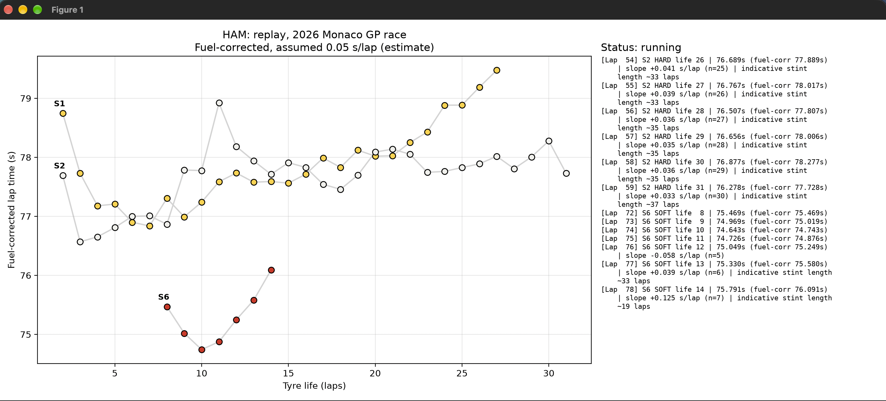

# F1 Tyre Degradation Analyzer
A Python tool that loads Formula 1 timing data, cleans and fuel-corrects lap times,estimates tyre degradation for each stint, and flags possible tyre "cliffs". Results can be viewed as a static chart or as a lap-by-lap replay window.

Built with FastF1 and tested on the 2026 Azerbaijan Grand Prix and 2026 pre-season testing data.



## Problem statement
Raw F1 lap times mix tyre wear with fuel burn, traffic, safety cars and pit laps, so it is hard to tell how quickly a tyre is acutally degrading during a run.

## What it does

- **Cleans the data:** removes in-laps, out-laps, unusually slow laps and (in race mode) safety car, virtual safety car and yellow-flag laps.
- **Corrects for fuel burn:** adds back the time a car gains as it gets lighter, so tyre wear is not hidden.
- **Estimates degradation:** fits a straight line per stint and reports the slope in seconds lost per lap.
- **Shows sensitivity:** prints corrected slopes for three assumed fuel effects(0..03, 0.05 and 0.07 s/lap) so you see a range instead of one falsely precise number.
- **Flags possible tyre cliffs:** raises an alert when two laps in a row are well off the stint's trend.
- **Replays a session lap by lap** in a window, where the monitor only uses laps that have already happen.

## Project Structure

| File | Purpose |
|------|---------|
| `tyre_deg.py` | Settings, data loading, fuel correction, stint slopes and the static chart |
| `live_monitor.py` | `StintMonitor` class: lap-by-lap filtering, slope updates and cliff alerts (terminal replay) |
| `live_window.py` | Replay window: live chart on the left, status log on the right |

**Note:** Keep all three files in the same folder. `live_monitor.py` and `live_window.py` import their settings from `tyre_deg.py`.

## Installation

```bash
git clone <your-repo-url>
cd <your-repo-folder>

python -m venv .venv
source .venv/bin/activate    # Windows: .venv\Scripts\activate

pip install -r requirements.txt
```

### requirements.txt:
```
fastf1>=3.8.3
matplotlib
numpy
```


## Usage

Edit the settings at the top of `tyre_deg.py`:

```python
YEAR = 2026
SESSION_MODE = "race"              # "race" or "testing"
EVENT = "Azerbaiijan"              # race mode: event name or
TEST_NUMBER = 2                     # testing mode only
DAY = 1                             # testing mode only
DRIVER = "LEC"                      # three-letter driver code
```

Then run one of:

```bash
python tyre_deg.py       # static chart + slope table
python live_window.py    # replay window (adjust REPLAY_DELAY_S to change speed)
python live_monitor.py   # replay printed in the terminal
```

The first run downloads data and can take a few minutes. Later runs use the local `cache` folder.

To find the right `TEST_NUMBER` in testing mode, uncomment `list_testing_events()` in the `__main__` block of tyre_deg.py for one run.

## How it works
1. **Load:** FastF1 loads the session. Telemetry, weather and messages are skipped because only lap data is needed.
2. **Filter:** quick laps only, no in/out laps, and (race mode) green-flag laps only.
3. **Fuel-correct:** for each stint, corrected time = lap time + fuel effect × laps since the stint's first lap. Only the burn rate matters, because each stint is compared with its own first lap.
4. **Fit:** a straight line of corrected lap time against tyre life gives the slope in seconds per lap. Stints with fewer than 5 laps are skipped.
5. **Alert:** in the replay, a lap far above the trend predicted from the stint's earlier laps counts as a cliff candidate, and two in a row raise an alert.

## Assumptions and limitations

Please read these before drawing conclusions from the output.

- **The fuel effect (0.05 s/lap) is an assumption,** not measured data. The true value depends on the car and the regulations. Treat results as a range.
- **The 22s pit loss** used for the "indicative stint length" is a placeholder.
- **Absolute lap times between stints are not comparable,** because starting fuel loads differ. Only the slope within each stint is meaningful.
Short stints give unreliable slopes. Engine modes, traffic and driver push level also change lap times within a run.
- **Testing data is noisy,** because teams run different programmes and test compounds.
- **The replay is not live.** FastF1 can only record a live feed for processing afterwards, so the "live" monitor replays a finished session.
- **Validation is limited.** The correction and filtering logic was checked on synthetic data, and the outputs have not been compared with team-grade analysis.

## Tech stack
Python, FastF1, pandas, NumPy, Matplotlib.
